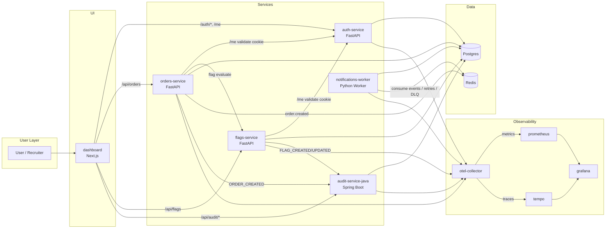

# RudikCloud Architecture

## Component Diagram

## Core Data Flows

## 1) Login and Session

1. User logs in from dashboard.
2. `auth-service` validates credentials, stores session server-side, and returns an httpOnly session cookie.
3. Dashboard includes credentials on future requests.
4. `GET /me` is used to resolve current identity.

## 2) Order Creation

1. Dashboard submits order to `orders-service` through dashboard API route.
2. `orders-service` validates user by calling `auth-service /me` using the incoming cookie.
3. `orders-service` evaluates `newCheckout` via `flags-service`.
4. Order row is inserted in Postgres with checkout variant and notification fields.
5. `orders-service` emits `order.created` to Redis stream.
6. `orders-service` emits `ORDER_CREATED` to `audit-service-java`.

## 3) Feature Flag Management and Evaluation

1. Dashboard calls `flags-service` to create/update flags.
2. `flags-service` authenticates by forwarding cookie to `auth-service /me`.
3. Flag is persisted in Postgres.
4. Flag change emits `FLAG_CREATED` / `FLAG_UPDATED` to `audit-service-java`.
5. Evaluation uses `enabled`, `allowlist`, and `rollout_percent` with stable user hashing.

## 4) Notification Worker Processing

1. `notifications-worker` consumes `order.created` from Redis stream.
2. Worker attempts delivery (mock send).
3. Worker updates order notification fields in Postgres:
   - `notification_status`
   - `notification_attempts`
   - `notification_last_error`
   - `notification_last_attempt_at`
4. On failure, worker schedules retry in Redis ZSET with exponential backoff.
5. After max attempts, worker pushes payload to DLQ stream and marks order `failed`.

## 5) Audit Event Flow

1. Services send audit events to `audit-service-java` with `X-Internal-Token`.
2. Audit service persists immutable records in `audit_events`.
3. Dashboard `/audit` queries filtered audit history for review/demos.

## 6) Observability Pipeline

1. Instrumented services emit OTLP telemetry to `otel-collector`.
2. Collector exports traces to Tempo and exposes metrics for Prometheus scraping.
3. Grafana uses Prometheus + Tempo datasources for dashboards and trace exploration.

## Design Notes

- Service boundaries are explicit and portfolio-friendly (Python APIs + Java audit service).
- Shared infrastructure is intentionally minimal for local reproducibility.
- Failure modes are demonstrable (worker retry/DLQ) and observable in both API state and telemetry.
